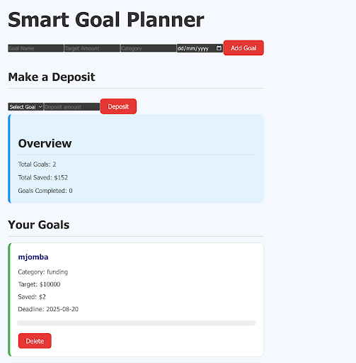

Smart Goal Planner

A  web application built with React for managing savings goals, tracking progress, and developing smart financial habits.

 By Abdirahman Dagane 
 

[live check out](https://daganeabdul.github.io/smart-goal-planner/)

 Project Description
 
What is this project?

 Smart Goal Planner is a React-based app that helps users set, manage, and track multiple savings goals. Each goal can have a name, target amount, deposit history, progress bar, and more. It promotes better financial planning using a clean and interactive interface.

 How Does It Work?
 
Users can:

  Add a new savings goal (e.g., “Buy a Laptop”, “Vacation Trip”)

  Allocate deposits to each goal

  View a progress bar showing percentage saved

 Edit or delete goals

 View history of deposits (with timestamps)

The application uses React components, state management, and local JSON Server (db.json) to persist data (CRUD).

 Who Are the Users?

This app is designed for:

Individuals planning multiple financial goals

Students learning React, CRUD operations, and component-based design

Teams building collaborative frontend apps

 Project Goals
 
To provide a full-stack-like experience with:

Component design using React

Form handling and validation

Dynamic rendering using state and props

Working with local APIs (via JSON Server)

 Features

 
Core Features

Add, view, edit, delete savings goals

Allocate deposits

Show progress with percentage bar

CRUD with db.json

Stretch Features

Filter by goal status (e.g., “In Progress”, “Completed”)

Deposit timeline with timestamp

Goal categories (e.g., Personal, Education, Business)

Sort by deadline or goal size

 How to Use

 
1. Clone the Repo

[git clone https://smart-goal-planner.git
cd smart-goal-planner](https://github.com/daganeabdul/smart-goal-planner.git)

-[smart-goal-api] ( https://github.com/daganeabdul/smart-goal-api.git)

2. Install Dependencies

       npm install

3. Start the JSON Server

        npm start

4. Run the React App
   
        npm run dev

 Project Structure
smart-goal-planner/

dist/
node_modile/
public/
src/
   assests/
   components/
       -AddGoadForm.jsx
       -DepositeForm.jsx
       -GoalCard.jsx
       -GoalList.jsx
       -overview.jsx
  app.css
  app.jsx
  index.css
  main.jsx
  .gitignore
 index.html
 package.json
 README.md
 vite.config.js

 Testing
 
Checklist for manual testing:

Add goals and check appearance

  Edit goal info and ensure changes persist

  Make a deposit and verify update

  Delete goal and check list updates

  Refresh browser – data should persist

  Use console logs or React DevTools to debug components and props.

 
MIT License

Copyright (c) 2025 daganeabdul

Permission is hereby granted, free of charge, to any person obtaining a copy
of this software and associated documentation files (the "Software"), to deal
in the Software without restriction, including without limitation the rights
to use, copy, modify, merge, publish, distribute, sublicense, and/or sell
copies of the Software, and to permit persons to whom the Software is
furnished to do so, subject to the following conditions:

The above copyright notice and this permission notice shall be included in all
copies or substantial portions of the Software.

THE SOFTWARE IS PROVIDED "AS IS", WITHOUT WARRANTY OF ANY KIND, EXPRESS OR
IMPLIED, INCLUDING BUT NOT LIMITED TO THE WARRANTIES OF MERCHANTABILITY,
FITNESS FOR A PARTICULAR PURPOSE AND NONINFRINGEMENT. IN NO EVENT SHALL THE
AUTHORS OR COPYRIGHT HOLDERS BE LIABLE FOR ANY CLAIM, DAMAGES OR OTHER
LIABILITY, WHETHER IN AN ACTION OF CONTRACT, TORT OR OTHERWISE, ARISING FROM,
OUT OF OR IN CONNECTION WITH THE SOFTWARE OR THE USE OR OTHER DEALINGS IN THE
SOFTWARE.

 

